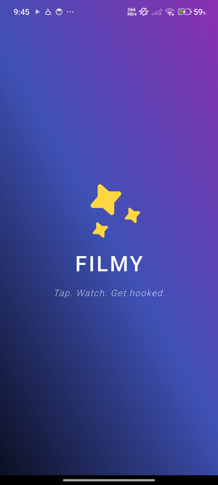
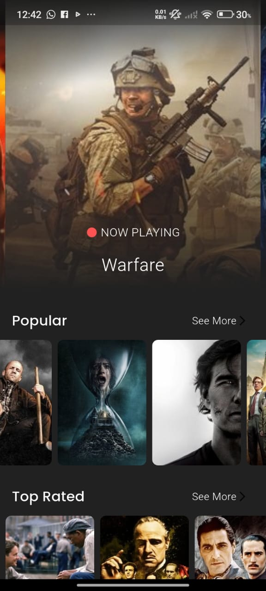
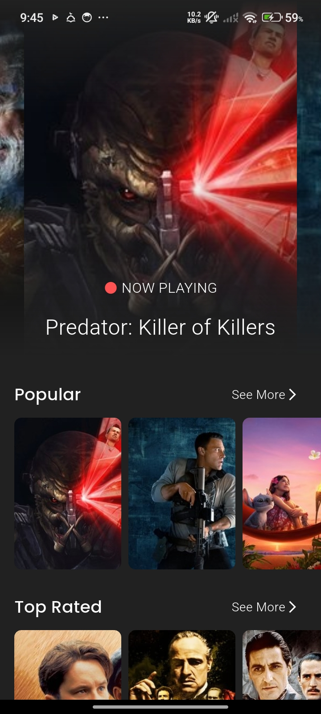
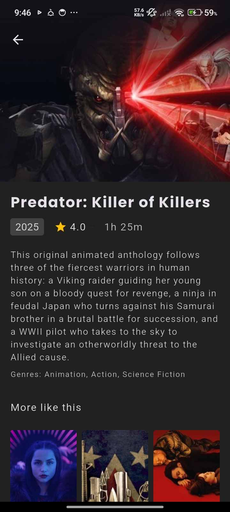
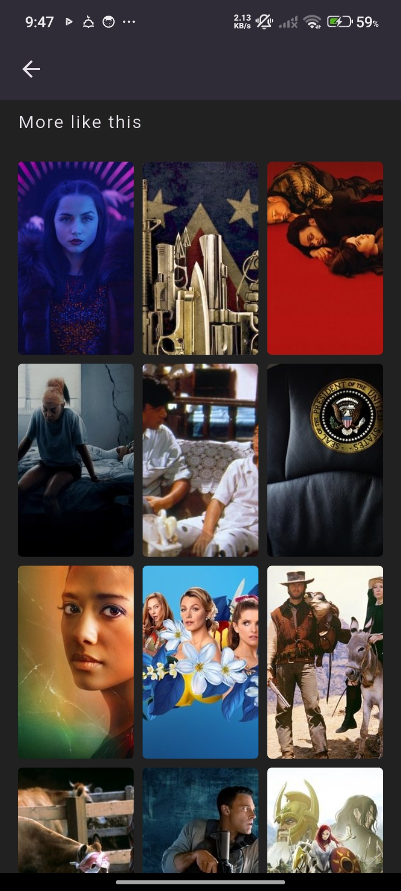
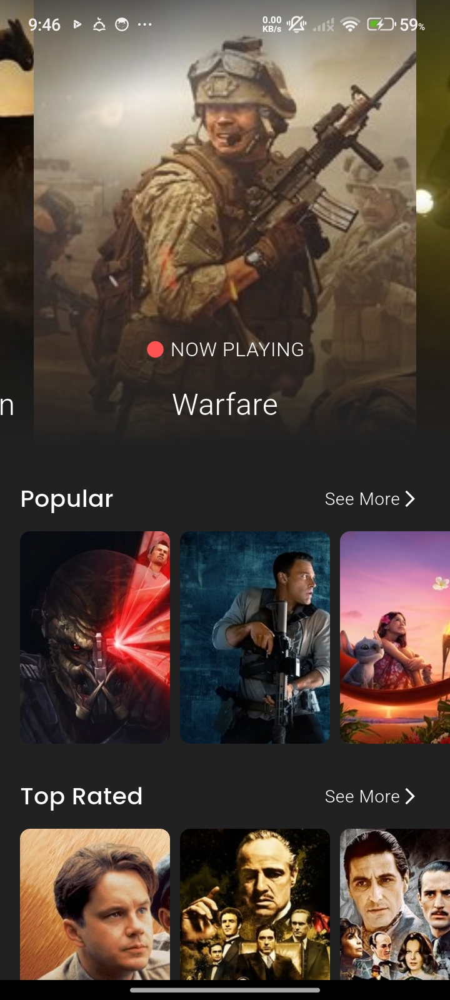
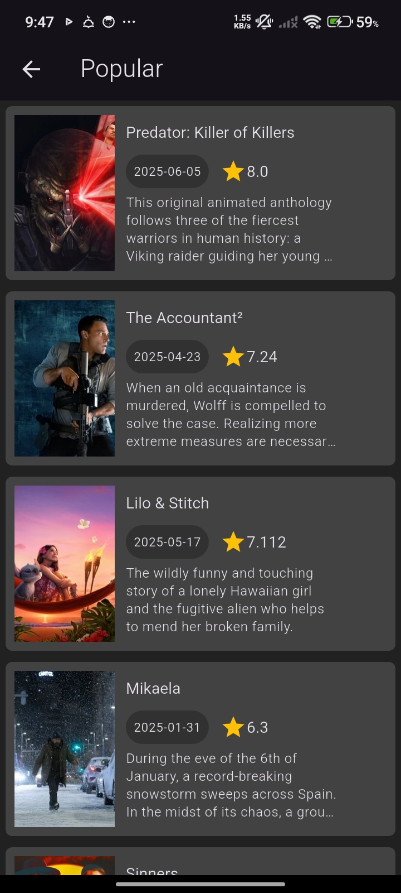
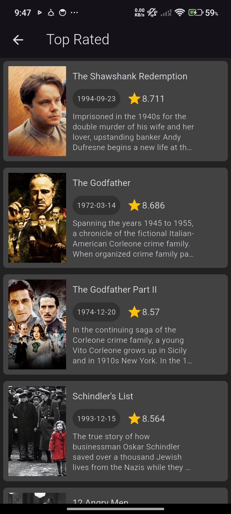

# Filmy App 🎬

#### A beautifully crafted Flutter application that showcases popular, top-rated, and now playing movies using **The Movie Database (TMDb) API**  Built with clean architecture principles and advanced state management using **Bloc**, the app delivers a seamless, scalable movie browsing experience..📱

---

## 🚀 Features

- 🔍 Browse popular, top-rated, and now playing movies
- 📝 Movie details with poster, overview, rating, and release date
- 💾 Caching and optimized API handling
- 📱 smooth and friendly UI
---

## 🧠 Tech Stack

- **Flutter** (Dart)
- **Bloc for state management**
- **Clean Architecture** (Data → Domain → Presentation)
- **Dio** for API requests
- **Equatable**, **flutter_bloc**, and **cached_network_image**
- **The Movie Database (TMDb)** API

---

## 🧱 Architecture

The app follows the **Clean Architecture** approach:

```
lib/
├── core/               # errors, network, services, use_case, utils.
├── movies/
│   ├── data/           # data sources, models, repository. 
│   ├── domain/         # Entities, repository (abstract), use cases
│   └── presentation/   # components, widgets, screens, controllers "Blocs"
└── main.dart           # Entry point of the application
```


### 🎥 Demo

[Click to watch the demo](https://www.linkedin.com/posts/mohamed-mousa-b1946a24a_flutter-filmy-moviesapp-activity-7338663045398761472-7j2A?utm_source=share&utm_medium=member_desktop&rcm=ACoAAD2l_8UBkpejvCs4ysZXKCYHBIQ_0xljbRY)


#### 🖼️ Screenshots

<p float="left">
  
  
  
  
  
  
  
  

</p>


---

## 🛠️ Setup
Feel free to clone the repo or connect:
1. **Clone the repo**:
   ```bash
   git clone https://github.com/MoMousa-22/Movies_App.git
   cd Movies_App
